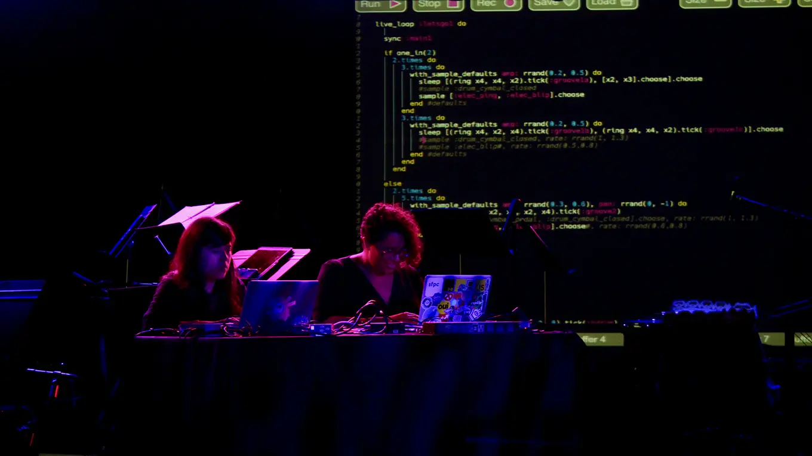
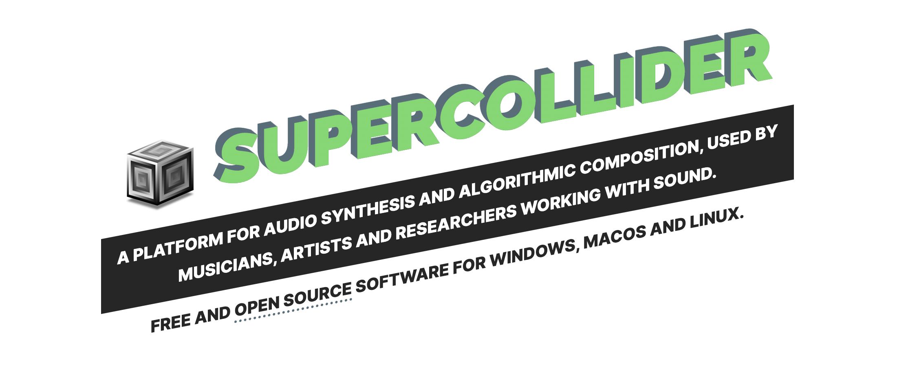
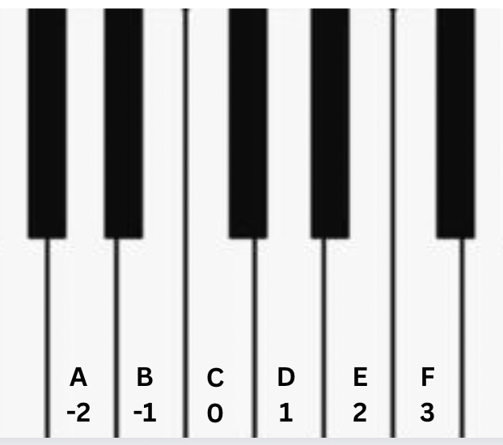

slidenumbers: true

### Beatmaking with Python & FoxDot

#### Sangarshanan


^
During the course of this talk i will introduce FoxDot, 
how you can harness the flexibility of python to make music
and in the process we will also write & play some nice music together
its a lot of fun!!
Acknowledge other talks on the same topic :)
Ryan Kirkbride at PyCon UK
Jessica Garson at PyCon 2019

---

github.com/sangarshanan/talks/

instagram.com/roguentropy/

soundcloud.com/roguentropy


^
before we start here are some links
this talk includes code & you can find the slides & code for this talk in this link
also plugged is my soundcloud and instagram where i post my coded music


---

## Livecoding



^ 
its an improvised performance art based where you write code
and use livecoding tools
to make music,visuals etc
it started off as a super niche things but now 
there are livecoding communities around the world

---

## What is Foxdot?

**🐍 Live Coding Synthesiser with Python**

**🎵 Abstraction to SuperCollider 
with TkinterGUI**

**✍️ Has its own IDE**

^
how much time do you have? basically synth is electronic musical instrument that generates audio signals of different waveforms that sound different, i.e we have sine, square, sawtooth waveforms that sound different


---




- scsynth – A real-time audio server
- sclang – Interpreted Language
- scide – Editor for sclang


---

## Installation

- SuperCollider 3.8 and above
- Tkinter
- `pip install FoxDot`
- `Quarks.install("FoxDot") `
- `FoxDot.start`

^
You need Python! duh
after installing supercollider, you need to install a Quarks which are like packages/extensions for SuperCollider
after installing the quark for FoxDot you just need to start it, our work with supercollider is done

---

## Running FoxDot


### `Python -m FoxDot`

^
now you get this really nice IDE to play around with!


---

## Player Objects

```python
p1 = Player("playa")

# Hook it up to a Synth

p1 >> prophet([0,1,2,3]) # Time to play

p1.stop() # Stop

print(SynthDefs) # List of Synths
```

^
the basis is everything is a player object
you can pass instructions to a player object using the double-arrow operator `>>` 
so we assign something called 'prophet' to player p1 and pass it a list
here Pads is the Synth and the list are the notes to play
well what is a Synth?
- show list of synths


---





^
- Now onto the notes, we have a list of integers [0,1,2,3], here number 0 is the first/root note which C followed by D,E,F,G,A,B. and going back by one will give me notes below middle C, so -2 is A that is below C
just imagine that the middle C note of the piano is 0, and then count white keys up or down.


---

## Player Attributes

```python
>>> print(Player.get_attributes())

('degree', 'oct', 'dur', 'delay', 'blur', 'amplify', 'scale', 
'bpm', 'sample','sus', 'fmod', 'pan', 'rate', 'amp', 'vib', 
'vibdepth', 'slide', 'sus','slidedelay', 'slidefrom', 'bend', 
'benddelay', 'coarse', 'striate', 'pshift','hpf', 'hpr', 
'lpf', 'lpr', 'swell', 'bpf', 'bpr', 'bits', 'amp', 
'crush', 'dist','chop', 'tremolo', 'echo', 'decay', 
'spin', 'cut', 'room', 'mix', 'formant', 'shape')
```

---

### Patterns

- shuffle: `P[:8].shuffle()`
- reverse, swap, rotate, stretch, trim etc...
- `P[:8].every(3, "reverse")`
- & More...

^
One of the most important things you do while Playing Music is create patterns and just manually entering
[0,1,2] everytime is not gonna cut it, Foxdot has some intuitive ways to play patterns that harness python
https://foxdot681713046.wordpress.com/docs/pattern-methods/


---


### Scales & Melodies

- Randomisation
- Creating Emotion
- Collaboration

^
Scales are extremely useful tools for coming up with melodies
if there are just random notes playing why do they not sound like noise, how does it become a melody. To understand that we need to understand scales. 
-In music: Scale is any set of musical notes ordered by fundamental frequency or pitch anf this is really important when constructing melodies cause scale become like an already existing pattern you can borrow from, this also really helps when you are playing with other musicians on entirely different instruments.
- the minor sounds very tense, in music you use random adjectives to describe melodies to sound sophisticated kinda
like how you can name random fruits to sound smart at a wine tasting.
- You can use Python random to leave things up to choice, pick a scale and just randomise a melody, everytime you play
you will hear a different melody playing because of randomisation

---


### Time Dependent Variables


TimeVars change after a pre-defined number of beats


`var([list_of_values],[list_of_durations])`

`a = var([0,4], 2)`

💯 THE COOLEST feature of FoxDot

^
you can use this to manipulate how things play with time, 
you can create chord progressions, switch to a new scale every 8 beats


---

### Samples

Done with boring notes? 
Does your Music need some juju?
Well foxdot has samples!!

`print(Samples)`


---


---


