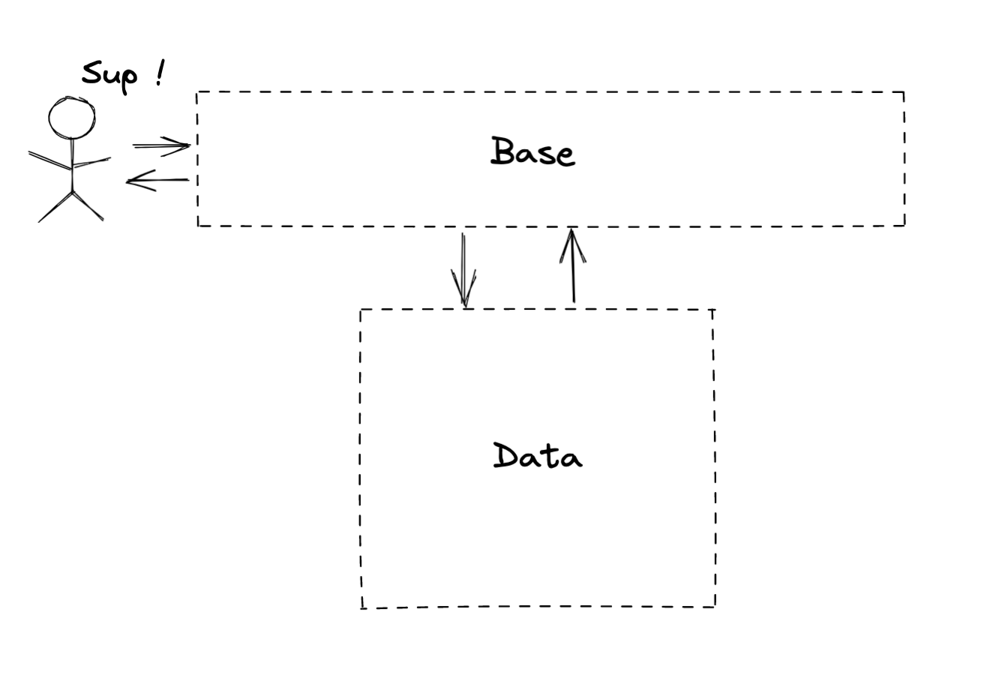
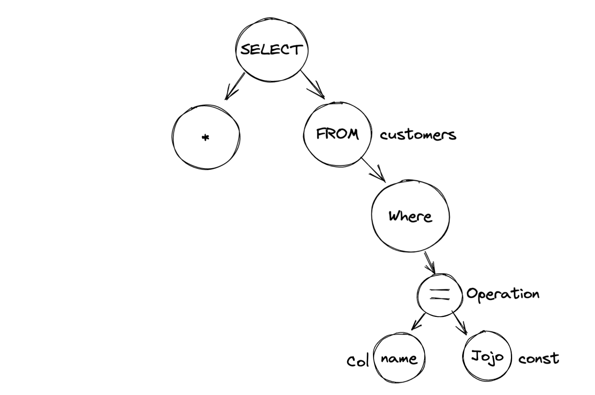
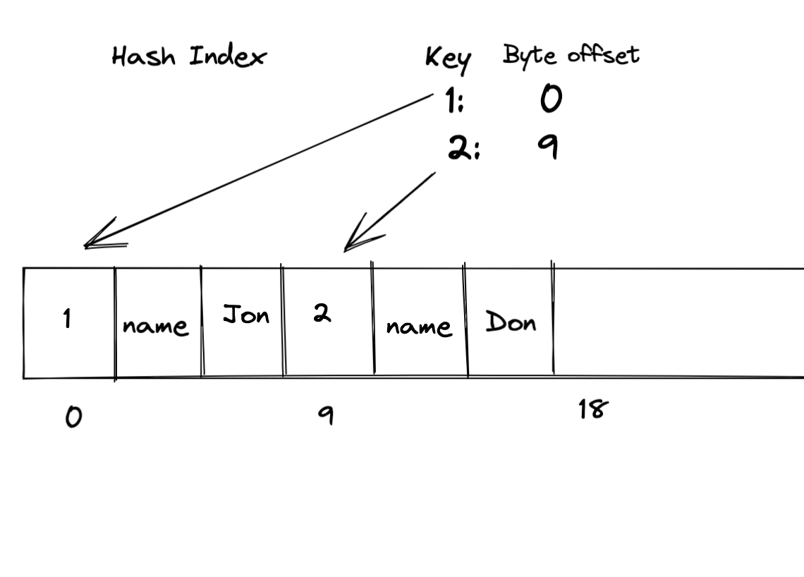
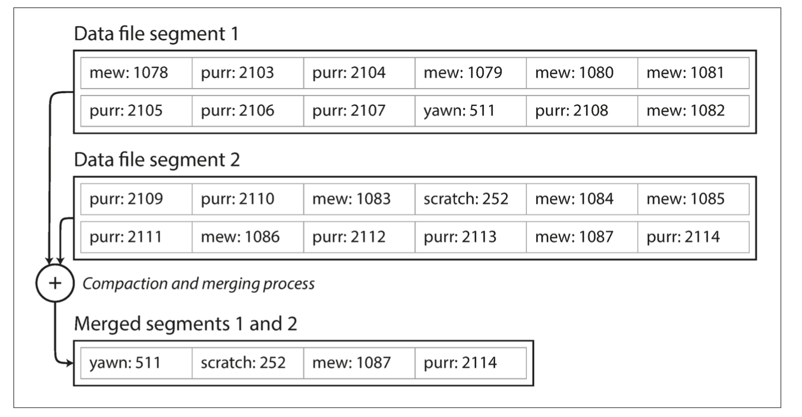
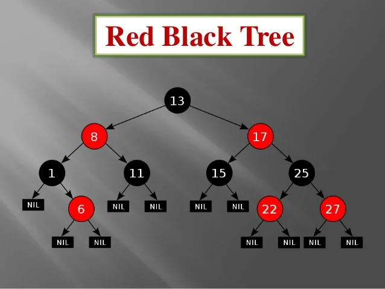
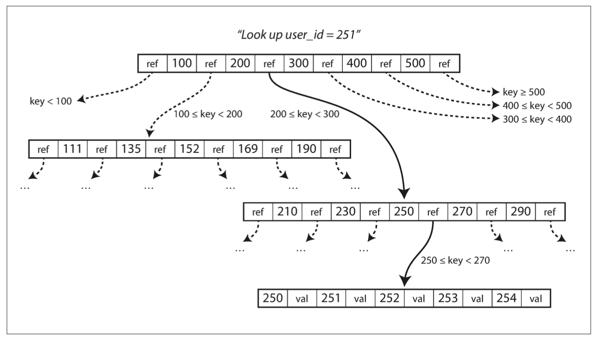
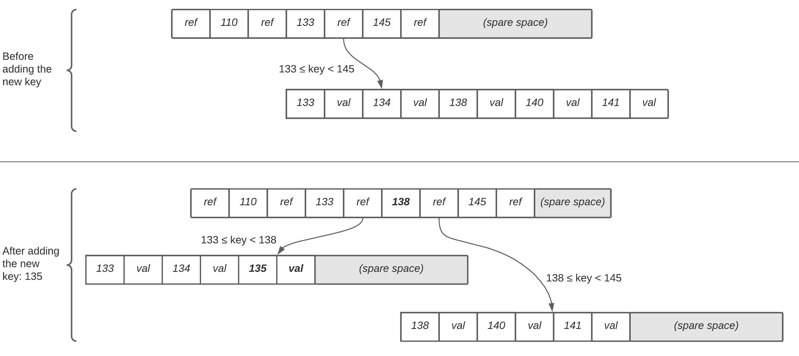

slidenumbers: true

# Build-a-Database

### Sangarshanan

^
Ssshhh 🤫 ! just pretend you didn't see this


---

# [fit] https://bit.ly/3EDwAAB


^
QR code, Most content is from first chapter of DDIA
i am not gonna livecode not cause im scared but just cause i am a slow typer

---


^
So a lil flashback sequence, imagine this scenario in black & white: i am an intern & for one of the first projects i was in, deciding on backend, all excited i suggest niche DBs, 
everyone knows im intern
gimme 3 reasons to not use postgres
i was surprised cause devs love to play like to play around with cool new toys 
and now i see myself saying it to people, becoming the very thing i swore to destroy
tbh its a solid advice but its not always right
when it came to DB we normally keep it safe, which is understandable but also
this made DBs a bit mystical

---

## New DB, who dis ?

- Break down the abstractions
- Reason about bad performance & bugs
- Happy Queries & Fewer Worries
- It is Fun ?

^
So cause of love for the the mystical, I decided to build my own DB but turns out that is not a
good enough reason to go around building a DB, so here are more

---


^
as this lucid dreaming victorian man once said

---




^
and for the longest time this is what I had in mind
A command center or Base you communicate with and Data it fetches from i dunno some far way land
where heart is shaped like a heart and the smell of pie makes you float

---

# Talking to your DB


^
First we need to figure out how to talk to our DB
good for us databases are great listeners
With our database tho, we are gonna use our friendly neighborhood terminal & do that
we are gonna build a REPL

---

##  Build-A-REPL 


```python
def repl(database):
    session = PromptSession()
    while True:
        text = session.prompt(f"YeetDB@{database}> ")
        try:
            qe = QueryExecutor(text)
            result, operation, time = qe.run()
        except Exception as error:
            stdout(f"ERROR: {error}")
        else:
            if result:
                stdout(result)
            else:
                stdout(f"{operation} executed in {round(time, 5)} sec")
    stdout("\nYeet!")
```

^
we are gonna use prompt toolkit to built a simple repl that runs in a while true loop
gonna have exits when user pressed ctrl C or ctrl D so they dont go crazy
and then we have our Queryexecutor which how we talk to our DB, we pass a text which in the case of a DB needs to be a query written in SQL,
Now the executor executes the SQL query and gives us the results


---

# SQL

^
what is a SQL, its just the language that our DB is fluent in, there are several dialect of SQL with so many rules which
never fails to put me to sleep, so we are gonna go easy and define a very simple language for our DB

---

## Grammar

```python
# Data Definition Language
ddl = ["create", "delete", ...]

# Data Manipulation Language
dml = ["select", "insert", ...]

# Wildcard
wild = ["*", ...]

# Data Query Language
dql = ["from", "where", "limit", ...]
```


^
we are gonna define a simple grammar made of DDL, DMU so you can use your database todo your dirty work, DQL and wildcards, there is a whole lot of grammar but for our DB this is it cause honestly SQL is our DBs second language, first being love

---

## Query Executor

```python
class QueryExecutor(object):
    """Query -> Tokenize -> AST Tree -> Execute."""

    def run(query):
    	tokens = QueryParser(query)
		tree = QueryPlanner(tokens)
    	result = tree.execute()
        return result
```

^
we have sql, we see what query executor is gonna do, its gonna parse the query to understand it,
plan the execution and then just execute it and return the results
lets look at an example

---

[.column]

###  i write a query

```sql
SELECT *
FROM
customer
WHERE
name = 'Jojo'
```


[.column]


### i get parsed

1. SELECT : dml
2.  * : wildcard
3. FROM : dql
4. customer - tableref
5. WHERE : dql
6. name : columnref
7. = : operator, Jojo : const

---

[.column]

### i have a plan



[.column]


### i execute


---

# [fit] Where is my Data ?


^
the base is over now cause we can talk to DB 
now comes the data part, where the fun begins
why not just save to memory

---

## In-Memory 🕯️

```python
class DataBase:
    def __init__(self, table):
        self.table = table
        self.database = {}
        if not self.database.get(self.table):
            self.database[self.table] = {}

    def insert(self, key, value):
        self.database[self.table][key] = value
    
    def select(self,key):
        return self.database[self.table].get(key)
    
    def delete(self, key):
        self.database[self.table].pop(key)
```

^
create a hashmap for every table and insert a new key for every day

---


### Oooh Queries

```python
db = DataBase("test") # Table name
db.insert("name", "barry")
db.insert("age", 35)
print(f"{db.select('name')} is {db.select('age')}")
> barry is 35
db.delete("age")
try:
    db.select('age')
except KeyError:
    print("you are Immortal !")
```

---

## But, Ummm... Persistence ?

---


## Remember to Flush !

```python
def insert(self,key,value):
    with open(self.table, 'a') as f:
        f.write(encode(key, value))

def delete(self,key):
    with open(self.table, 'a') as f:
        f.write(encode(key, 🪦))
```

### Tombstones 💀 on deletes

^
encode converts to be written into binary
when reading records, we just throw KeyError when we encounter tombstones

---

### Append only logs

- Oh So Simple 👌
- Sequential writes on disk 🚀


### But, Umm

- O(n) worst-case select 😭
- partial records & ever-growing log file ❌


^
What i loved about having the data in-memory was our ability to lookup things super fast
and the flexibility of choosing data structure

---


^
lets bring back our in-memory dictionary but rather than making it our primary data storage
we make it cache and use it to lookup where the actual data

---


^
these are called Indexes
we maintain an additional structure we write to, but reads are gonna be much faster
we just index on id or primary key
Lets start simple with

---

## Hash Index

In-memory mapping of every key to byte offset location




^
Hash Index is just an dict
so if someone is looking for key 2 they can directly seek the 9th byte offset in the data file

---


[.column]

```python
class HashIndex:
    def __init__(self, name):
        self.name = name
        self.index = {}

    def insert(self, key, value):
        # Write to file and save offset
        with open(self.name, 'a') as f:
            f.seek(0, 2) # first line from the end
            end_offset = f.tell() # end offset
            f.write(encode(key,value))
        # create index using offset
        self.index[key] = {
            "offset": end_offset,
            "pk_size": len(f"{key}"), 
            "data_size": len(f"{value}"),
            "data": f"{value}"
        }
```

[.column]

```python
def get(self, key):
    # Read from Offset and length
    try:
        return self.index[key]["data"]
    except:
        MissingDataException()

def delete(self,key):
    key_index = self.index[key]
    with open(self.name, 'a') as f:
        char = f.seek(key_index["offset"])
        # Tombstone
        f.write(encode(f"{key}<EOK><NAN><EOP>"))
    self.index.pop(key, None)
```


^
know length of our record to get the offset we needs to read till
Great we solved our speed issue but still got ever growing append-nly log file
avoid eventually running out of disk space ?

---

### [fit] Break the logs into blocks/segments


^
A good solution is to break the log into segments of a certain size by closing a segment file when it reaches a certain size, and making subsequent writes to a new segment file.
which means we will have duplicate inserts & should read the latest log, to do that we do something called compaction
We can then perform compaction on these segments. Compaction means throwing away duplicate keys in the log, and keeping only the most recent update for each key.

---




^
generally compaction makes segments much smaller, we can also merge several segments together at the same time as performing the compaction.
segments are never modified & merged segments are written to a new file
its a background process
After the compaction we switch read requests to using the new merged segment & old segment files can be deleted

---

### Hell yeah 🤘

1. Super Fast lookups + Append only writes
2. Crash recovery + Concurrency

### But Umm...

1. Lot of keys <> Lot of issues
2. Range queries

^
PRO
- fast lookup and fast sequential writes, Recreate in-mem hashmap from segments, also we have only one writer thread. Data file segments are append-only and otherwise immutable, so they can be read concurrently by multiple threads.
- 
CONS
- if you have a very large number of keys :( cannot be in-memory
you could maintain a hash map on disk BUT iss difficult to make an on-disk hash map perform well. 
It requires hella random access I/O & is expensive to scale, also with scale we will have hash collisions to be handled
- For example, you cannot easily scan over all keys between 0 and 900 —you’d have to look up each key individually in the hash maps

---

# Sorting FTW

### ** Happy interviewer noises **


^
we can make a simple change to the format of our segment files: we require that the sequence of key-value pairs is sorted by key, maintaining sorted data in memory can be easily done using balanced Trees


---

## [fit] An In-memory balanced tree



^
Red black trees is a self-balancing special binary search tree so it can hold sorted data in-memory while keeping basic search/insert & deletes to a `O(log n)` complexity
it does that by following some simple rules and make sure every insert/delete operation doesnt break the rules, rules are like
- Every node is either red or black 
- The root & leaf nodes of the tree is always black.
- A red node cannot have a red parent or red child
Well i am not gonna start a data structures lectures here, there are other indians on internet for that


---


^
if the database crashes, we need to regenerate this tree from scratch since the logs in segment on disk 
are still not sorted
So Now we need a way to keep this sorted structure on disk, so we have persistence for out index too

---


# B Trees

### Nodes <> Pages

^
we just switch nodes used in-memory trees to fixed-size blocks / pages
this is consistent with underlying hardware cause disks are also arranged in fixed-size 
blocks.
So each pages consists of pointers to the actual data and references to child pages
which kinda looks like this

---



^
One page is designated as the root of the B-tree; whenever you want to look up a key in the index, you start here. The page contains several keys and references to child pages. Each child is responsible for a continuous range of keys, and the keys between the references indicate where the boundaries between those ranges lie.
Here we are looking for 251
The number of references to child pages in one page of the B-tree is called the branching factor, In Figure the branching factor is six.
Typically a tree with a branching factor of 500, has four-levels with 4 KB pages can store up to 256 TB


---

## [fit] Changes to the Pages on a Btree


^
now again i am gonna fully break down how exactly the insert, update & delete operations work on a btree but just
a general idea
updating a key is just overwriting the page with a new page with updated key

---

## Insertion

Just inserting a key /  splitting a page (no space )



---

## Deletions

- Leaf
    - Depends on number of keys
- Internal
    - Depends on the keys & Children

^
deletes are a bit complex and depend on leaf or internal node
might require rebalancing and splitting of pages

---


^
btree has been around since the 70s, so its as old as my dad, they still remain the standard index implementation in almost all relational databases & many nonrelational databases
The btree operations we discussed ensure that the tree remains balanced, meaning
a B-tree with n keys always has a depth of O(log n)

---

## Old Boy, New tricks

- copy-on-write tree pages
- WAL logs
- latches & locks


^
I have not done this in my DB, but here are some ideas to implement based on what real DBs do
Rather than overwriting pages, we can create a copy and then just change the reference
this actually lets us do some super cool things, MVCC
To ensure more consistency, We also have WAL logs which is just a log of all operations the happen to the btree
 like we haven't broken down ACID properties, Transactions & when we make our DB distributed, its a whole other realm
if this gives you goosebumps, lets talk about more it

---


- Mon 11 - Tue 12 Jul: Tutorials & Workshops
- Wed 13 - Fri 15 Jul:  Conference talks & sponsor exhibition
- Sat 16 - Sun 17 Jul: Sprints


^
a small plug about, amazing conf on the other side of the atlantic
Trans*code, Makers fest, Beginners day workshop, Django girls
fin aid
schedules going to be out next week-ish

---

# [fit] Thank you 🙏


^
Thank you & Q&A
