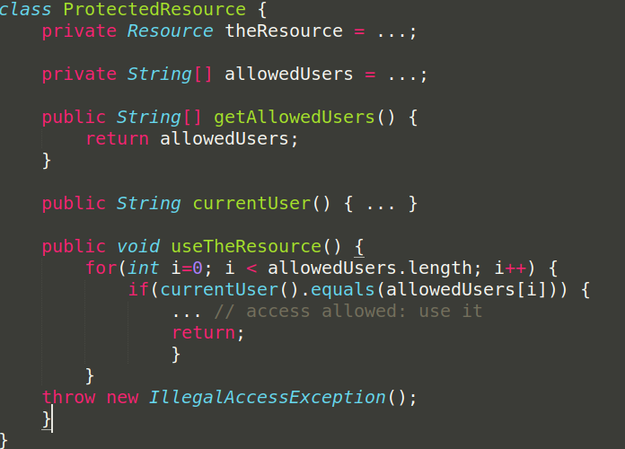

name: inverse
layout: true
class: center, middle, inverse

---

# Functional Programming Concepts

---

# Before...

Not about Functions but rather the Side Effects

Most material from Programming languages: Dan Grossman

Intro to ML family (Standard ML, OCaml, F#, Haskell, Elm)

Helps if you can write fluently in any prog language

---

# Variables

An ML program is a sequence of bindings that get type checked and evaluated

```sml
val x = e; (* keyword variable = expression)
```

This is a binding *NOT AN ASSIGNMENT* (No more i+=1)

---

# Shadowing

Shadowing is when a variable declared within a certain scope has the same name as a variable declared in an outer scope

```python
a = 5
f = lambda x : x + a
a = 10
f(1)
# Returns 11 #
```

Down in Functional Land

```sml
val a = 5
fun f x = x + a
val a = 10
val b = f(1)
(* Returns 6 *)
```

Mutable assignment expression vs Immutable value binding
---

# Functions

Static Type Checking

```sml
fun f x = x + 5

(* val f = fn : int -> int *)
```

Deduced at compile time by evaluating the expression
---

# Tuples / Lists

```sml
Tuple
- val x = (1,2);
val x = (1,2) : int * int

Access operation
- #1 x;
val it = 1 : int

List
- val x = [1,2,4];
val x = [1,2,4] : int list

Append Operation
- val y = 5::x;
val y = [5,1,2,4] : int list

- [10] :: [[1,2],[3]];
val it = [[10],[1,2],[3]] : int list list 

Head Operation
- hd [1,2];
val it = 1 : int

Tail Operation
- tl [1,2,3];
val it = [2,3] : int list
```
---

# Immutability

```sml
fun sort_pair (pr : int*int) =
    if (#1 pr) < (#2 pr) then pr else ((#2 pr),(#1 pr))
```

In sort_pair we clearly build and return a new pair in the else-branch but in the then-branch, do we
return a copy of the pair referred to by pr or do we return an alias ?


```sml
val x = (3,4)
val y = sort_pair x
```

Immutability means we let compiler worry about it ( ML has aliases under the hood )

---

# Pitfalls of Mutations




---

# Pitfalls of Mutations

Here getAllowedUsers returns an alias to the allowedUsers array

This means any user can gain access by doing getAllowedUsers()[0] = currentUser(). 

Hackerman ! 

This would not be possible if we had some sort of array in Java that did not allow its contents to be updated. 

Instead in Java we often have to remember to make a copy.

---
# Recursion

Multiply all elements in a list

```sml
fun product_list (xs : int list) =
    if null xs then 1 else hd xs * product_list(tl xs);
```
val product_list = fn : int list -> int

```math
product_list( [1, 2, 3] )

1 * product_list( [2, 3] )

1 * 2 * product_list([3])

1 * 2 * 3

6
```
---
# Recursion

CountDown from N to 1

```sml
fun countdown (n : int) =
    if n = 0 then [] else n :: countdown(n-1)
```

 val countdown = fn : int -> int list


```math
countdown( 3 )

3 :: countdown( 2 )

3 :: 2 :: countdown( 1 )

3 :: 2 :: 1 :: countdown( 0 )

[3,2,1]

```

---

# Recursion

Hello world of Recursion 

```sml
fun factorial (n: int) = 
    if n = 0 then 1 else product_list (countdown(n))
```

val factorial = fn : int -> int

---

# Recursion

Tail recursion means efficiency

Common Recursive Funcs:

**map** which takes an input collection and applies a function to each element in the collection

**filter** which takes an input collection and a predicate function which returns a boolean and tests every input against the predicate, then returns only a collection of the elements which return true

**reduce (or fold)** which takes an input collection and applies a function which takes an accumulator and a value and turns it into a single value, eventually returning a single value (like a String or an Int).

---

# Datatype Bindings

Types are easily created

```sml
datatype mytype = 
TwoInts of int*int
| Str of string
| Pizza
```

Adds a new type mytype to the environment

Adds **constructors** to the environment. TwoInts, Str & Pizza


---
# Pattern matching

```
fun f (x: mytype) =
case x of
Pizza => 3
| Str s => String.size s
| TwoInts(i1,i2) => i1 + i2

```

---
# Pattern matching

we can now pass the constructors to the function to Get values of mytype depending on the case

```sml
- f Pizza;
(* val it = 3 : int *)

- f (Str "hello");
(* val it = 5 : int *)

- f (TwoInts(1,2));
(* val it = 3 : int *)
```
---

# Pattern matching in Lists

Better style to use **pattern-matching for accessing list and option values**

```sml
fun product_list (xs) =
    case xs of [] => 1 | x::xs => x * product_list(xs)
```

By using patterns to access values of lists Type is also inferred by the compiler !

---

## Powerful 

## Efficient

## Predictable

---

# There is more... Oh so much more!

---

layout: false
